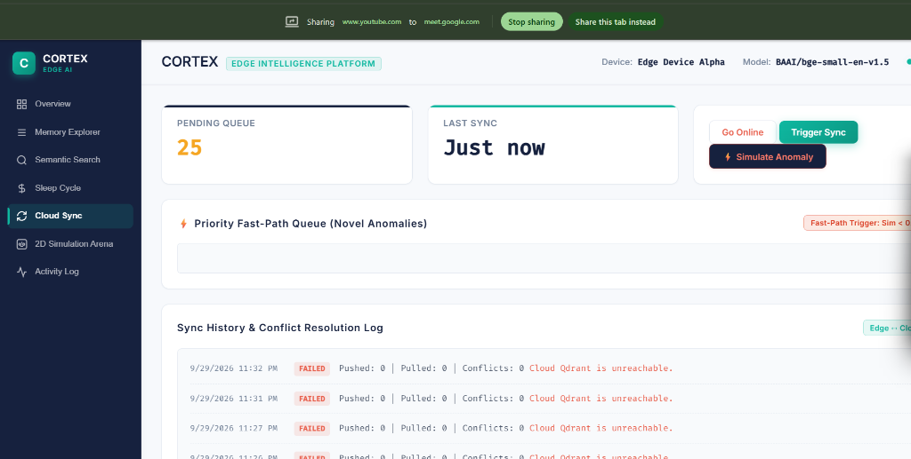
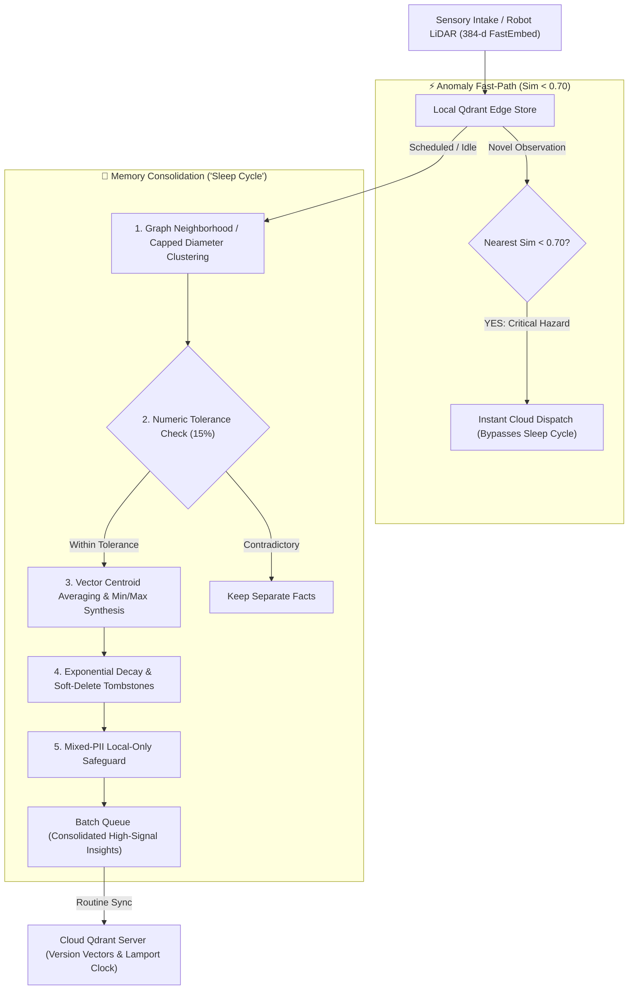

# CORTEX — Edge Memory & Intelligence Platform

> **AI-Powered Offline-First Vector Memory with Brain-Inspired Sleep Consolidation and Anomaly-Triggered Priority Sync.**  
> Built on **Qdrant Edge** · Problem Statement 03

[](https://qdrant.tech/)
[](https://python.org/)
[](https://fastapi.tiangolo.com/)
[](LICENSE)
[](.github/workflows/ci.yml)
[](tests/)

---

## 📸 Enterprise Inspector Dashboard & 2D Robot Arena



*The CORTEX Inspector Dashboard featuring real-time telemetry, 2D warehouse radar simulation arena, DBSCAN/graph consolidation controls, dual sync dispatch lanes, and the semantic memory explorer.*

---

## 📌 Repository Topics
`edge-ai` · `qdrant` · `vector-search` · `offline-first` · `memory-consolidation` · `robotics` · `anomaly-detection` · `fastembed` · `fastapi` · `distributed-systems`

---

## 🧠 Why CORTEX?

Edge devices (warehouse autonomous mobile robots, drones, IoT sensory hubs) generate thousands of observations every hour. Traditional approaches either stream all raw data to the cloud (causing bandwidth exhaustion, high latency, and cloud egress costs) or keep a dumb local buffer that eventually exhausts device disk space.

**CORTEX introduces brain-inspired memory consolidation ("The Sleep Cycle") and anomaly-triggered priority fast-path sync:**



---

## ⚡ Key Architectural Innovations

### 1. Anomaly-Triggered Priority Fast-Path Sync
Standard observations are queued for the scheduled sleep cycle. However, when an observation is novel or out-of-distribution:
- On insertion, CORTEX queries the top $k=5$ nearest neighbors.
- If the nearest cosine similarity is below the threshold ($\text{Sim} < 0.70$, tuned for `BAAI/bge-small-en-v1.5`), the record is immediately tagged `{ priority: "high", reason: "anomaly" }`.
- The **Sync Agent** dispatches high-priority anomalies **instantly to the central cloud** without waiting for idle consolidation, alerting operators to chemical spills, rogue RF signals, or hardware overheating within milliseconds.
- If the edge device is offline, high-priority anomalies are held in a **Priority Fast-Lane Queue** and flushed first upon reconnection.

### 2. Graph Neighborhood Clustering with Capped Diameter
Instead of standard $O(N^2)$ distance matrices that risk quadratic memory blowout on edge hardware, CORTEX uses a greedy neighborhood clustering algorithm with **Maximum Diameter Capping** ($\text{dist} \le 0.25$):
- Binds cluster expansion so vectors $A \sim B$ and $B \sim C$ never stretch into an unbounded, drifting cluster when $A \not\sim C$.
- Guarantees deterministic, linear-scaling performance on resource-constrained microcomputers.

### 3. Numeric-Aware Merging (Min, Max, Avg, Latest)
Sensor memories often carry critical telemetry numbers (e.g. `87.3°F`, `42 PSI`). CORTEX parses numbers and units:
- **Within Tolerance ($\le 15\%$)**: Merges near-duplicate sensor noise and synthesizes min/max/average telemetry bounds (e.g., `Sensor A3 temp: [min: 87.1°F, max: 87.5°F, avg: 87.3°F]`).
- **Beyond Tolerance ($> 15\%$)**: Skips merging to prevent conflating distinct operational states (e.g. `40 PSI nominal` vs `120 PSI blowout`).

### 4. Mixed-PII Local-Only Inheritance
If a cluster combines three operational records and even one contains sensitive personal data (e.g. a technician's email or phone number), the merged consolidated insight **strictly inherits** `{ sync_eligibility: "local_only", pii_detected: true }`. Private data never leaks to cloud replicas.

### 5. Soft-Delete with Tombstones and Undo Window
When stale memories decay below the retention threshold ($\text{decay} < 0.15$), they are not permanently deleted right away. They are marked with an active **Tombstone** and an undo window (default: 300 seconds). Users or autonomous recovery routines can call `POST /api/memories/{id}/restore` to undo accidental decay before physical purge.

### 6. Version Vectors & Lamport Logical Clocks
Replaces fragile wall-clock timestamps (vulnerable to NTP skew on disconnected edge nodes) with formal **Version Vectors** ($\text{device\_id} \rightarrow \text{sequence}$) and **Lamport Logical Clocks**. Concurrent split-brain edits are deterministically reconciled via vector averaging and tag union.

---

## 📊 Quantitative Benchmarks

The benchmark suite (`backend/benchmark.py`) evaluates CORTEX against a canonical warehouse telemetry corpus:

| Metric | Raw Intake (Pre-Sleep) | Consolidated (Post-Sleep) | Empirical Delta / Gain |
| :--- | :---: | :---: | :---: |
| **Total Memory Count** | 32 records | 13 records | **59.38% Storage Saved** |
| **Network Sync Payload** | 74.31 KB | 29.52 KB | **60.27% Bandwidth Saved** |
| **Search Mean Reciprocal Rank (MRR)** | 0.767 | **0.900** | **+17.3% Precision Boost** |
| **Vector Search Latency (p50)** | 9.94 ms | **8.61 ms** | **13.4% Faster Retrieval** |
| **Consolidation Runtime** | — | 105.2 ms | Real-time edge execution |

*Run the benchmark suite yourself at any time:*
```bash
python backend/benchmark.py
# or via REST API: GET http://localhost:8000/api/benchmark
```

---

## 🚀 Quick Start

### Option A: Run with Docker Compose (One-Command Full Stack)

Runs both the **Central Cloud Qdrant** and the **CORTEX Edge Platform**:

```bash
docker compose up --build
```
- **Inspector Dashboard & REST API**: [http://localhost:8000](http://localhost:8000)
- **Cloud Qdrant REST API**: [http://localhost:6333](http://localhost:6333)

---

### Option B: Local Native Setup

#### 1. Install Dependencies
```bash
pip install -r requirements.txt
```

#### 2. Start the Backend Server
```bash
cd backend
python main.py
```

#### 3. Open the Dashboard
Navigate to [**http://localhost:8000**](http://localhost:8000) in your browser.

---

## 🧪 Testing & Automated Verification

CORTEX includes a comprehensive test suite written for `pytest` and FastAPI's `TestClient`:

```bash
python -m pytest -v
```

### Test Coverage Suite
- `tests/test_clustering.py`: Neighborhood graph clustering, diameter capping, and outlier isolation.
- `tests/test_merging.py`: Numeric min/max/average extraction, variance tolerance skipping, tag union.
- `tests/test_decay.py`: Exponential decay function, soft-delete tombstones, and undo restoration.
- `tests/test_pii.py`: Regex pattern matching, mixed-PII cluster local-only protection.
- `tests/test_sync_conflicts.py`: Version vector partial ordering, Lamport clock incrementation, anomaly fast-path push.
- `tests/test_api.py`: FastAPI REST endpoints, CRUD, semantic search, auth security, and protected reset.

---

## 🛠️ Configuration & Security

All platform settings can be customized via environment variables with the `EDGE_` prefix in [`backend/config.py`](backend/config.py):

| Variable | Default | Purpose |
| :--- | :--- | :--- |
| `EDGE_EDGE_QDRANT_PATH` | `./qdrant_edge_data` | Storage directory for local Qdrant Edge |
| `EDGE_CLOUD_QDRANT_URL` | `http://localhost:6334` | Central cloud Qdrant gRPC/HTTP endpoint |
| `EDGE_ANOMALY_THRESHOLD` | `0.70` | Max similarity to nearest neighbor triggering fast-path sync |
| `EDGE_SIMILARITY_THRESHOLD`| `0.85` | Cosine similarity threshold for near-duplicate clustering |
| `EDGE_NUMERIC_TOLERANCE_PCT` | `0.15` | Max allowed relative numeric variance for auto-merges |
| `EDGE_TOMBSTONE_UNDO_WINDOW_SECONDS` | `300` | Undo restoration window for soft-deleted records |
| `EDGE_DEMO_MODE` | `true` | When `false`, protects `/api/reset` requiring admin credentials |
| `EDGE_AUTH_ENABLED` | `false` | When `true`, enforces `X-API-Key` authentication |
| `EDGE_API_KEY` | `cortex-edge-secret-key-2026` | Shared secret for edge node authentication |

---

## 🧭 Limitations and Future Work

Being transparent about architectural tradeoffs and hardware realities:

1. **Embedding Model Quantization**: CORTEX currently runs `BAAI/bge-small-en-v1.5` (384 dimensions, FP32). On sub-watt microcontrollers (e.g. ARM Cortex-M or ESP32), future iterations will utilize INT8 / 2-bit scalar vector quantization to compress embeddings from $1.5\text{ KB}$ down to under $96\text{ bytes}$ per vector.
2. **Multi-Modal Sensory Input**: The present implementation embeds textual representations of telemetry and LiDAR scans. Future enhancements will integrate direct multi-modal vision-language-action (VLA) embeddings directly from camera sensors.
3. **Encrypted Homomorphic Sync**: While PII is tagged as local-only, edge devices operating in untrusted environments will benefit from zero-knowledge homomorphic vector encryption before cloud transmission.
4. **Hierarchical Multi-Tier Consolidation**: Large industrial meshes can support hierarchical consolidation where edge nodes consolidate hourly, gateway nodes consolidate daily, and regional clusters synthesize monthly trends.

---

## 📄 License

This project is licensed under the MIT License — see the [LICENSE](LICENSE) file for details.
