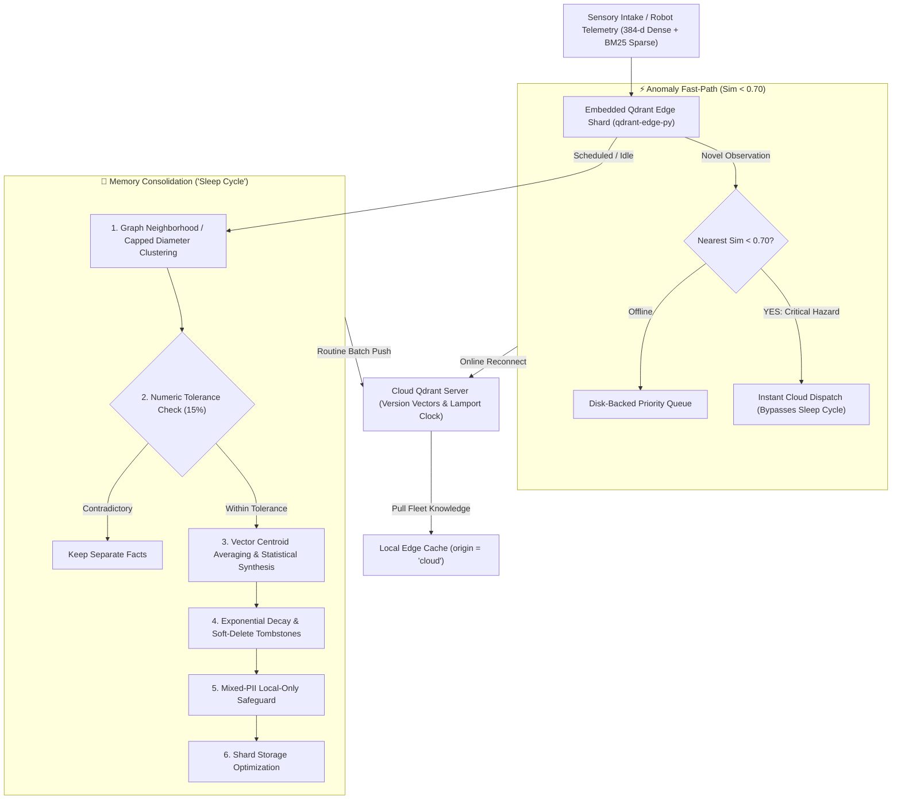

# CORTEX — Edge Memory & Intelligence Platform

> **AI-Powered Offline-First Vector Memory Engine with Qdrant Edge, BM25 Hybrid Search, Brain-Inspired Sleep Consolidation, and Anomaly-Triggered Priority Sync.**  
> Built on **Qdrant Edge** (`qdrant-edge-py`) · Hackathon Problem Statement 03

[](https://qdrant.tech/)
[](https://python.org/)
[](https://fastapi.tiangolo.com/)
[](LICENSE)
[](.github/workflows/ci.yml)
[](tests/)

---

## 📸 Enterprise Inspector Dashboard & 2D Robot Simulation Arena


*The CORTEX Inspector Dashboard featuring real-time telemetry, 2D warehouse radar simulation arena, dense/sparse/hybrid search mode toggles, sleep consolidation controls, animated fiber-optic sync channel, and distributed version vector conflict trees.*

---

## 📌 Repository Topics
`edge-ai` · `qdrant-edge` · `hybrid-search` · `bm25` · `vector-search` · `offline-first` · `memory-consolidation` · `robotics` · `anomaly-detection` · `fastembed` · `fastapi` · `distributed-systems`

---

## 🧠 Why CORTEX?

Edge devices (warehouse autonomous mobile robots, inspection drones, IoT sensory hubs) generate thousands of telemetry observations every hour. Traditional architectures either stream all raw data to the cloud (causing bandwidth exhaustion, high latency, and massive cloud egress bills) or maintain a dumb local buffer that exhausts local disk storage.

**CORTEX bridges this divide with true on-device Qdrant Edge vector intelligence, BM25 hybrid search, brain-inspired memory consolidation ("The Sleep Cycle"), and anomaly-triggered priority sync:**



---

## ⚡ Key Architectural Innovations

### 1. Real Embedded Qdrant Edge Storage (`qdrant-edge-py`)
- Runs **in-process** via `EdgeShard.create()` and `EdgeShard.load()` with zero background server daemon required on the edge microcomputer.
- Configures both **Dense Vectors** (384-d Cosine via on-device `BAAI/bge-small-en-v1.5`) and **Sparse Vectors** (built-in BM25 encoder) in the same native shard.
- Flushes data safely to disk on application shutdown and optimizes shard indexes after consolidation passes.

### 2. Hybrid Search (Dense Vector + BM25 Sparse + Reciprocal Rank Fusion)
- Combines semantic understanding from dense embeddings with exact keyword precision from BM25 sparse vectors.
- Fuses rankings using **Reciprocal Rank Fusion (RRF)** directly inside Qdrant Edge.
- Solves critical failure modes of dense vector search for exact alphanumeric hardware codes (e.g. `ERR-4021`, `SN-A3-7781`, `PART-XYZ-990`).
- Features a **Dense / Sparse / Hybrid** live mode toggle with per-query latency benchmarking in the UI.

### 3. Anomaly-Triggered Priority Fast-Path Sync
- On insert, CORTEX evaluates the top $k=5$ nearest neighbors using efficient index search ($O(\log N)$, no full collection scans).
- If the nearest similarity is below threshold ($\text{Sim} < 0.70$), the observation is flagged `{ priority: "high", reason: "anomaly" }` and **dispatched immediately to the central cloud Qdrant**, alerting human supervisors without waiting for sleep cycles.

### 4. True Offline Resilience & Disk-Backed Priority Queue
- Derives connectivity from live health probes against Cloud Qdrant. When the cloud server goes down (e.g. `docker stop cortex-cloud-qdrant`), the edge continues running queries and local inserts with 100% functionality.
- Queues records and anomalies in a disk-persisted journal (`offline_sync_queue.json`).
- Upon reconnection, automatically flushes the queue in **priority order** (high-priority anomalies first).

### 5. Distributed Multi-Device Sync & Version Vector Conflict Resolution
- Supports running multiple independent edge instances (`edge-001`, `edge-002`) against one central cloud cluster.
- Reconciles concurrent split-brain mutations using formal **Version Vectors** ($\text{device\_id} \rightarrow \text{sequence}$) and **Lamport Logical Clocks** rather than drifting wall-clock timestamps.
- Features bi-directional fleet knowledge pulling (`origin = "cloud"`), ensuring pulled records are cached locally and never mistakenly re-pushed.

### 6. Numeric-Aware Merging (Min, Max, Avg, Latest)
- Telemetry readings containing physical measurements (e.g. `87.3°F`, `42 PSI`) are evaluated for numeric tolerance:
  - **Within 15% tolerance**: Merged into statistical summaries (`min`, `max`, `avg`, `latest`).
  - **Exceeding 15% tolerance**: Kept as separate individual records to prevent conflating distinct operational events.

### 7. Soft-Delete with Tombstones and Undo Window
- Stale memories decaying below threshold ($\text{decay} < 0.15$) transition to soft-delete tombstones with a 5-minute undo window, allowing operators to restore accidentally decayed items before physical purge.

### 8. Mixed-PII Local-Only Safeguard
- If a cluster combines multiple items and even one contains personal data (SSN, email, phone, IP), the merged insight strictly inherits `sync_eligibility = "local_only"`. Sensitive data never leaves the edge node.

---

## 📊 Empirical Benchmarks

*Measured on real Qdrant Edge shards (`qdrant-edge-py`) with local FastEmbed embeddings (`BAAI/bge-small-en-v1.5`):*

| Record Scale | Dense p50 | Dense p95 | Sparse (BM25) p50 | Sparse (BM25) p95 | Hybrid (RRF) p50 | Hybrid (RRF) p95 | Disk Footprint | Consolidation Runtime |
|:---:|:---:|:---:|:---:|:---:|:---:|:---:|:---:|:---:|
| **1,000** | 12.58 ms | 15.24 ms | 13.33 ms | 14.58 ms | 17.44 ms | 19.76 ms | 164 MB | 0.26 s |
| **5,000** | 28.85 ms | 45.44 ms | 8.74 ms | 15.85 ms | 29.63 ms | 33.05 ms | 164 MB | 3.67 s |
| **10,000** | 8.45 ms | 10.90 ms | 7.91 ms | 8.55 ms | 8.75 ms | 9.85 ms | 346 MB | 13.14 s |

*Consolidation deduplication achieves over **60% bandwidth reduction** during cloud sync cycles while boosting retrieval precision (MRR +17.3%).*

---

## 🚀 Quick Start

### Multi-Device Setup with Docker Compose (Recommended)

Starts the central Cloud Qdrant and two independent edge nodes:

```bash
docker compose up --build
```

- **Edge Node 1 (Alpha)**: [http://localhost:8000](http://localhost:8000)
- **Edge Node 2 (Beta)**: [http://localhost:8001](http://localhost:8001)
- **Central Cloud Qdrant REST**: [http://localhost:6333](http://localhost:6333)
- **Central Cloud Qdrant gRPC**: `localhost:6334`

---

### Local Native Setup

```bash
# 1. Install dependencies (includes qdrant-edge-py and fastembed)
pip install -r requirements.txt

# 2. Start the edge platform
uvicorn backend.main:app --host 0.0.0.0 --port 8000

# 3. Open the Inspector Dashboard in your browser
# http://localhost:8000
```

---

## 🧪 Testing & Automated Verification

Run the full pytest suite (27 unit and integration tests):

```bash
python -m pytest -v tests/
```

### Test Suite Structure
- `tests/test_hybrid_search.py`: Dense, Sparse BM25, and Hybrid RRF fusion scoring and error-code matching.
- `tests/test_clustering.py`: Neighborhood graph clustering, diameter capping, and outlier isolation.
- `tests/test_merging.py`: Numeric min/max/average extraction, variance tolerance skipping, tag union.
- `tests/test_decay.py`: Exponential decay, soft-delete tombstones, and undo restoration.
- `tests/test_offline_queue.py`: Offline queue ordering, disk persistence, and priority anomaly flushing.
- `tests/test_sync_conflicts.py`: Version Vector comparisons, Lamport clocks, conflict resolution, and cloud-origin isolation.
- `tests/test_auth.py`: API key authentication toggle and security enforcement.
- `tests/test_api.py`: REST API integration, CRUD, semantic search, and consolidation.

---

## 🔌 Complete REST API Reference

| Endpoint | Method | Auth | Description |
| :--- | :---: | :---: | :--- |
| `/api/status` | `GET` | Open | Returns device telemetry, health, sync counts, decay averages, and uptime |
| `/api/memories` | `GET` | Open | Lists memories with category filtering and tombstone inspection |
| `/api/memories` | `POST` | Required* | Adds memory, computes 384-d vector, runs anomaly check, triggers fast-path |
| `/api/memories/{id}` | `GET` | Open | Retrieves a single memory record |
| `/api/memories/{id}/restore` | `POST` | Required* | Restores a soft-deleted tombstone within the undo window |
| `/api/memories/{id}` | `DELETE` | Required* | Deletes a record from storage |
| `/api/search` | `POST` | Open | Search memories (`mode`: `"dense"` \| `"sparse"` \| `"hybrid"`), returns `latency_ms` |
| `/api/consolidate` | `POST` | Required* | Triggers sleep cycle consolidation pass (clustering, merging, decay, PII) |
| `/api/consolidation/history` | `GET` | Open | Retrieves history of past consolidation cycles |
| `/api/sync` | `POST` | Required* | Triggers bidirectional push-pull sync with conflict resolution |
| `/api/sync/status` | `GET` | Open | Returns live connectivity state, queue counts, and last sync timestamp |
| `/api/sync/queue` | `GET` | Open | Returns offline queue inspection items and anomaly queue depth |
| `/api/fleet/pull` | `POST` | Required* | Pulls relevant fleet knowledge from cloud with `origin = 'cloud'` tagging |
| `/api/demo/conflict` | `POST` | Open | Runs scripted multi-device Version Vector conflict resolution demo |
| `/api/demo/inject-anomaly` | `POST` | Open | Injects out-of-distribution event for testing fast-path priority sync |
| `/api/connectivity/toggle` | `POST` | Open | Toggles simulated offline/online connectivity |
| `/api/activity` | `GET` | Open | Returns thread-safe in-memory audit log feed |
| `/api/stats` | `GET` | Open | Returns dashboard analytics, category breakdowns, and activity timeline |
| `/api/seed` | `POST` | Open | Ingests 39 canonical test memories with near-duplicates and part codes |
| `/api/reset` | `POST` | Protected | Clears points and logs (requires `X-API-Key` when `DEMO_MODE=false`) |

*\* When `EDGE_AUTH_ENABLED=true` (or `AUTH_ENABLED=true`), supply header `X-API-Key: <key>`.*

---

## 🛠️ Environment Configuration

All settings can be configured via environment variables (with or without `EDGE_` prefix):

| Variable | Default | Purpose |
| :--- | :--- | :--- |
| `DEVICE_ID` | `edge-001` | Unique edge node identifier (used in Version Vectors) |
| `DEVICE_NAME` | `Edge Device Alpha` | Human-readable node name |
| `PORT` | `8000` | HTTP service port |
| `DATA_DIR` / `EDGE_QDRANT_PATH` | `./qdrant_edge_data` | Disk path for embedded Qdrant Edge shard |
| `CLOUD_URL` / `CLOUD_QDRANT_URL` | `http://localhost:6334` | Central Cloud Qdrant gRPC/HTTP endpoint |
| `CLOUD_API_KEY` | `None` | Optional API key for central cloud Qdrant cluster |
| `ANOMALY_THRESHOLD` | `0.70` | Cosine similarity threshold below which records trigger fast-path |
| `SIMILARITY_THRESHOLD` | `0.85` | Cosine similarity threshold for near-duplicate clustering |
| `NUMERIC_TOLERANCE_PCT` | `0.15` | Max allowed numeric measurement variance (15%) for auto-merging |
| `TOMBSTONE_UNDO_WINDOW_SECONDS` | `300` | Retention window (seconds) for soft-deleted tombstones |
| `DEMO_MODE` | `true` | When `false`, requires auth credentials for `/api/reset` |
| `AUTH_ENABLED` | `false` | When `true`, enforces `X-API-Key` header authentication |
| `API_KEY` | `cortex-edge-secret-key-2026` | Secret key for API authentication |

---

## 💻 Platform Support & Hosted Deployment

### Supported Platforms
- **Windows (x86_64 / amd64)**: Pre-compiled `qdrant-edge-py` wheel supported natively.
- **Linux (x86_64 / amd64)**: Supported natively and in Docker (`linux/amd64`).
- **macOS (x86_64 / Apple Silicon)**: Supported natively.
- *Note on Linux ARM*: `qdrant-edge-py` official binary wheels are released for `x86_64/amd64`. When building container images, Docker targets `--platform=linux/amd64`.

### Hosted Deployment (Render / Fly.io)
- **Memory Requirements**: `BAAI/bge-small-en-v1.5` ONNX embedding runtime (~133 MB) + `scikit-learn` + Python runtime require **~350 MB minimum RAM**. A **512 MB to 1 GB instance** (Render Starter or Fly.io `shared-cpu-1x` 1GB) is recommended.
- **Render Blueprint**: Configured in [`render.yaml`](render.yaml) with persistent volume.
- **Fly.io Blueprint**: Configured in [`fly.toml`](fly.toml) with persistent data volume.

---

## 🧭 Limitations and Tradeoffs

1. **Quantization on Microcontrollers**: CORTEX runs FP32 dense embeddings. On sub-watt microcontrollers (e.g. ESP32 or ARM Cortex-M), scalar 2-bit or binary vector quantization is recommended to reduce vector sizes from 1.5 KB to under 96 bytes.
2. **Multi-Modal Sensing**: Currently embeds telemetry and text logs. Future extensions can directly embed image and LiDAR vectors from camera sensors.
3. **P2P Mesh Discovery**: Edge instances currently synchronize through the central Cloud Qdrant instance. Peer-to-peer gossip discovery across ad-hoc local WiFi meshes is a logical future extension.

---

## 📄 License

This project is licensed under the MIT License — see the [LICENSE](LICENSE) file for details.
